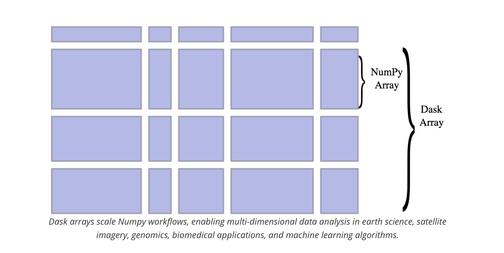

# Alfred workflow. URL to TiddlyWiki5 image reference

[Alfred](https://www.alfredapp.com/) workflow that converts the url of an image to a TiddlyWiki5 image URL. For example:


```html
img2tiddly https://dask.org/_images/dask-array-black-text.svg Dask arrays scale Numpy workflows, enabling multi-dimensional data analysis in earth science, satellite imagery, genomics, biomedical applications, and machine learning algorithms.

=>

[img[https://dask.org/_images/dask-array-black-text.svg]]
<figcaption>
Dask arrays scale Numpy workflows, enabling multi-dimensional data analysis in earth science, satellite imagery, genomics, biomedical applications, and machine learning algorithms.
</figcaption>
```


