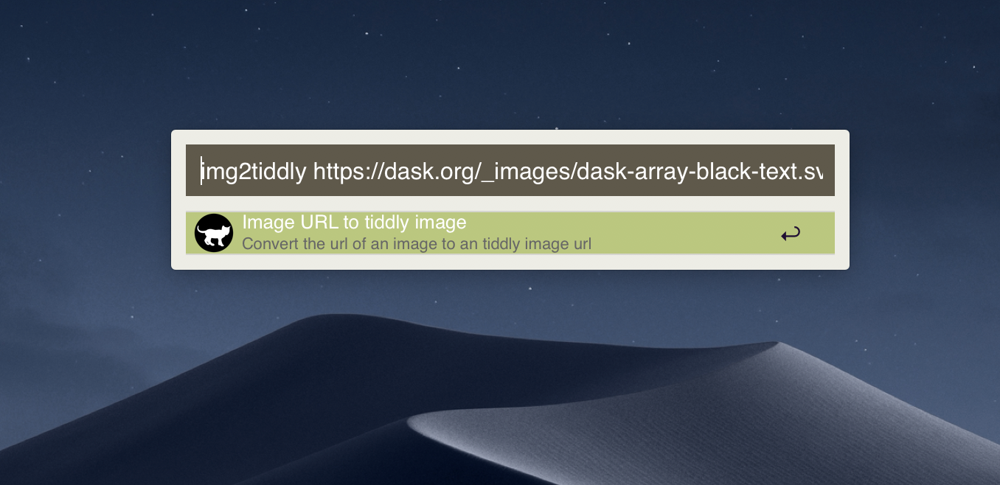

# Alfred workflow. URL to TiddlyWiki5 image reference

[Alfred](https://www.alfredapp.com/) workflow that converts the url of an image to a [TiddlyWiki5](https://tiddlywiki.com/) image URL. If the image URL is followed by a space, then all the subsequent text is transformed into a figure caption. For example an Alfred command like



becomes an TiddlyWiki expression like this:

```
[img[https://dask.org/_images/dask-array-black-text.svg]]
<figcaption>
Dask arrays scale Numpy workflows, enabling multi-dimensional data analysis in earth science, satellite imagery, genomics, biomedical applications, and machine learning algorithms.
</figcaption>
```

What looks like this in TiddlyWiki:


